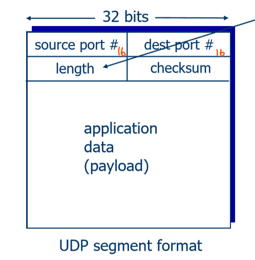
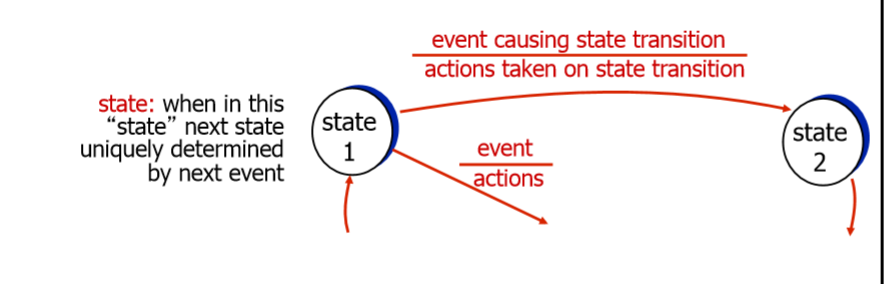

# Transport Layer 

## Topics Included
* Transport layer services
* Multiplexing and demultiplexing
* Protocols: Connectionless transport: UDP
* Protocols: Connection-Oriented transport: TCP
* TCP Congestion control

## Transport Services and Protocols 
Provide *logical Communication* between app processes running on different hosts.

Transport layer gets port address (addr within machine). The IP addr (added by network layer) and MAC addr (added by data link layer) just get to machine, not interally. Port (transport), IP (network), Mac (data link) together uniquelu identify a port in a specific machine.

Transport Protocols run in end systems. (routers don't see end to end, just whatevers coming through. Trasnport layer is for logical end to end transport. The clients in trasnport layer will see packets lost and whole picture)
* **Send side**: break app messages into segments, passes to network layer. Moves down OSI stack adding headers as it goes.
* **RCV side**: reassembles segments into messages, passes to app layer 

There is more than one transport protocol available to apps: TCP and UDP are internet protocols.

## Internet Transport Layers Protocols 
### TCP 
* reliable, in order delivery (of packets)
    * congestion control (timers)
    * flow control -limit rate at which data packets are sent (buffer space)
    * Connection Setup- "Handshake" to agree ports etc

### UDP 
* unreliable, unordered delivery (of packets)
    * no frills extension of "best-effort" IP(which does nothing but inject packets into network)
    * lightweight- no connection setup 

### Services not available 

 * Delay guarantees- no upperbound on delay of packet in NW
 * Bandwidth guarantee

**Question**: What type of services can we run over TCP and UDP?

* TCP: any sort of data application/web - need all packets back in same order 

* UDP: multimedia application - if the odd packet gets dropped it's no big deal. The video or audio file might just glitch a tiny bit.

## Multiplexing and Demultiplexing 
* Multiplexing:at sender handle data from multiple sockets, add transport header (later used for demultiplexing)
* Demultiplexing at receiver: use header info to deliver received segments to correct socket 

### How demultiplexing works?
Host receives IP datagrams
    * each datagram has source IP addre, destination IP addr
    * each datagram carries one transport-layer segment
    * each segment has source, destination port number
Host uses IP addresses and port number to direct segment to appropriate socket 

### Connection oriented demux
TCP socket identified by 4-tuple (to get to right application on machine)
    * source IP address
    * source port number
    * dest IP address
    * dest port number

Receiver uses all 4 values to direct segment to appropriate socket

  * demultiplexing

Server host may support many simultaneous TCP sockets
   * each socket identified by it's own 4 tuple

Web servers have different sockets for each connecting client
    * non persistent HTTP will have a different socket for each request

#### Connection Oriented Demux Example I
Transport layer gives concept of port- allows us to uniquely identify destination input

### Connection Oriented Demux Example II

## User Datagram Protocol (UDP)
* No frills internet protocol 
* "best effort" service where UDP segments may be 
    * lost 
    * delivered out-of-order to app 
* **Connectionless** : no handshaking between UDP sender and receiver (no set up phase)
    * Each UDP segment handles independently of others 
* Uses
    * Streaming multimedia apps (loss tolerant, rate sensitive)
    * DNS (Domain name system)- if DNS query and no respons, then make another DNS query 
    * SNMP (Simple Network Management Protocol) 

### UDP Header 

* length= length in bytes of UDP segment including header 
* only 8 bytes long compared to IP header's 20 bytes length 

**Why is there a UDP?**

* No connection establishment - which can add delay
* Simple - no connection state at sender/receiver
* small header size
* No congestion control - simple protocol to implement, UDP can blast away as fast as desired 

**Downside**

UDP lets users transmit as much as they want, which could result in everyone else on the network being killed ( no one else can transmit data)

## Principles of Reliable Data Transfer 

RDT is important in application, transport and link layers. Characteristics of the unreliable channel will determine complexity of *reliable data transfer* protocol.

* rdt = reliable data transfer 
* udt = unreliable data transfer 

On the service implementation side...
* rdt_send() : called from above, (eg by app). Passed data to deliver to receiver upper layer. 
* deliver_data() : called by rdt to deliver data to upper 
* udt_send() : called by rdt to transfer packet over unreliable channel to receiver (makes into IP packet and pushed down stack to data layer )
* rdt_rcv() : called when packet arrives on rcv-side of channel

**RDT** 

* We will incrementally develop sender, receiver sides of rdt protocol 
* Consider only unidirectional data transfer - but control info will flow in both directions
* Use finite state machines (FSM) to specify sender, receiver 

### Reliable Transfer over a reliable channel rdt1.0
* Underlying channel perfectly reliable 
    * no bit errors 
    * no loss of packets 

* Seperate FSMs for sender and receiver 
    * sender sends data into underlying channel 
    * receiver reads data from same underlying channel

### Channel with Bit errors RDT2.0
* underlying channel may flip bits in packet
    * checksum to detect bit errors 
* How to recover from errors?
    * Acknowledgements (ACKS or Negative acks) - sent back as own packets or piggybacking on previously requested data 
    * receiver explicitly tells sender that pkt received ok
* Negative Acknowledgements (NAKs)- can have seperate nak field or 1 for ack and 0 for nak 
    * receiver explicitly tells sender that pkt had errors
    * sender retransmits pkt on receipt of nak -Buffer requirement implication here as sender must buffer pkt until receive ack

* New mechanisims in 2.0 not in 1.0 
    * error detection
    * feedback 
        * control msgs (ACK,NAK) from receiver to sender

