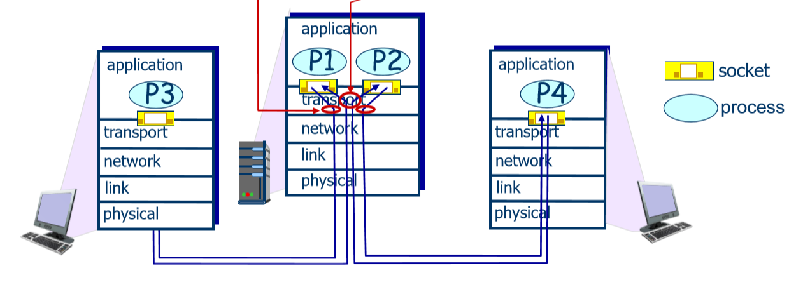

# Transport Layer 

## Topics Included
* Transport layer services
* Multiplexing and demultiplexing
* Protocols: Connectionless transport: UDP
* Protocols: Connection-Oriented transport: TCP
* TCP Congestion control

## Transport Services and Protocols 
Provide *logical Communication* between app processes running on different hosts.

Transport layer gets port address (addr within machine). The IP addr (added by network layer) and MAC addr (added by data link layer) just get to machine, not interally. Port (transport), IP (network), Mac (data link) together uniquelu identify a port in a specific machine.

Transport Protocols run in end systems. (routers don't see end to end, just whatevers coming through. Trasnport layer is for logical end to end transport. The clients in trasnport layer will see packets lost and whole picture)
* **Send side**: break app messages into segments, passes to network layer. Moves down OSI stack adding headers as it goes.
* **RCV side**: reassembles segments into messages, passes to app layer 

There is more than one transport protocol available to apps: TCP and UDP are internet protocols.

## Internet Transport Layers Protocols 
### TCP 
* reliable, in order delivery (of packets)
    * congestion control (timers)
    * flow control -limit rate at which data packets are sent (buffer space)
    * Connection Setup- "Handshake" to agree ports etc

### UDP 
* unreliable, unordered delivery (of packets)
    * no frills extension of "best-effort" IP(which does nothing but inject packets into network)
    * lightweight- no connection setup 

### Services not available 

 * Delay guarantees- no upperbound on delay of packet in NW
 * Bandwidth guarantee

**Question**: What type of services can we run over TCP and UDP?

* TCP: any sort of data application/web - need all packets back in same order 

* UDP: multimedia application - if the odd packet gets dropped it's no big deal. The video or audio file might just glitch a tiny bit.

## Multiplexing and Demultiplexing 
* Multiplexing:at sender handle data from multiple sockets, add transport header (later used for demultiplexing)
* Demultiplexing at receiver: use header info to deliver received segments to correct socket 

### How demultiplexing works?
Host receives IP datagrams
    * each datagram has source IP addre, destination IP addr
    * each datagram carries one transport-layer segment
    * each segment has source, destination port number
Host uses IP addresses and port number to direct segment to appropriate socket 

### Connection oriented demux
TCP socket identified by 4-tuple (to get to right application on machine)
    * source IP address
    * source port number
    * dest IP address
    * dest port number

Receiver uses all 4 values to direct segment to appropriate socket

  * demultiplexing

Server host may support many simultaneous TCP sockets
   * each socket identified by it's own 4 tuple

Web servers have different sockets for each connecting client
    * non persistent HTTP will have a different socket for each request

#### Example
Transport layer gives concept of port- allows us to uniquely identify destination input

